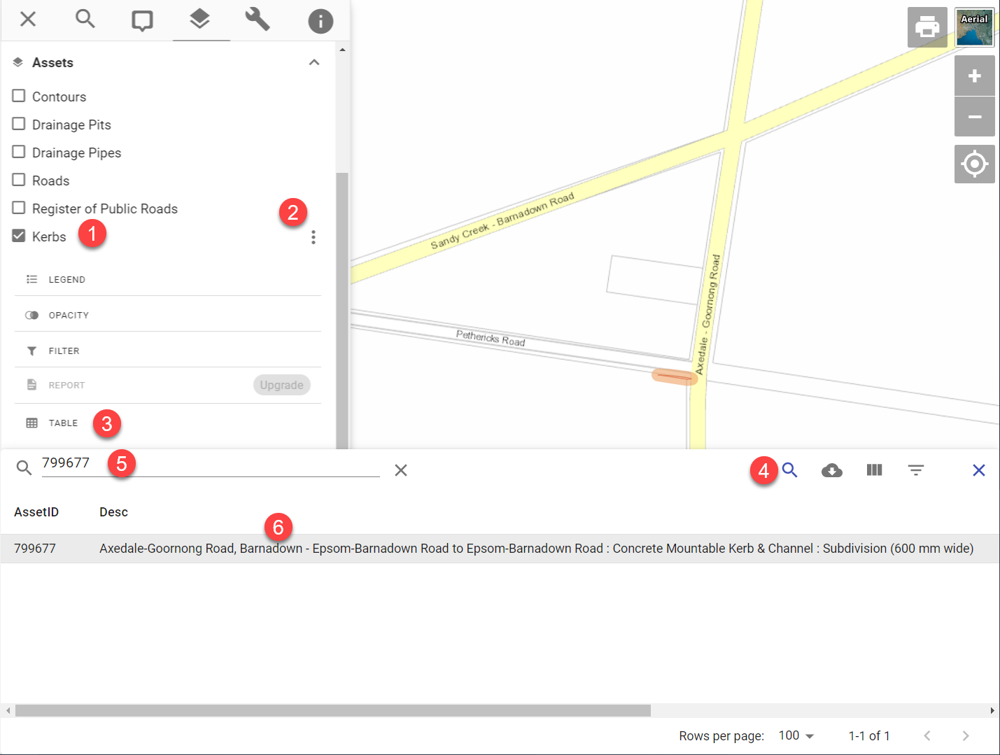

# Browse

1. turn on layer
2. click options button (three dots next to layer name)
3. select Table

## Searching

With the table open:

1. click Search
2. start typing text
3. select desired record

{style="width:600px"}

The map will zoom to the selected record's location, highlight the feature, and hide all other features.

## Filtering
