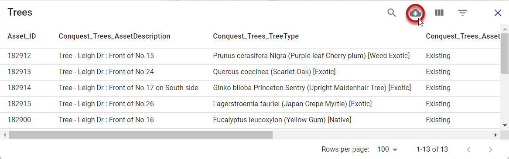

# Enquire

To discover information about any location on the map, click on the map or use the search tool to find your location.

The Pozi *Info Panel* displays Details about the location or selected feature.

## What's Here

When enquiring on a location via clicking on the map or doing a search, Pozi displays information from a variety of data sources that are relevant to the location. This enquiry mode is called *What's Here*.

### Simple Selection

Simple selections are triggered by any of the following events:

* a single click on the map
* using the Search function
* opening Pozi using a link that specifies a target location or feature id
  * example: https://westwimmera.pozi.com/#/search[propertynumber,1018753]/

### Multi Selection

In addition to enquiring on single locations, Pozi enables you to enquire on regions and multiple locations.

#### Regions

To enquire on a region:

1. click Tools > Select > Select by region
2. click on the map to start drawing
3. click on map locations to define the boundary of the enquiry region
4. double-click to finish

#### Paths

To enquire on a path (for example, to select all the properties along a pipeline or other linear feature), use the line selection tool.

1. click Tools > Select > Select by line
2. click on the map to start drawing
3. click on map locations to define the enquiry path
4. double-click to finish

#### Additional Point Locations

You can add point locations to any current *What's Here* selection by holding down the `Ctrl` key and clicking on the map.

#### Viewing and Exporting Results

The results of a multi-selection can be viewed as a table and optionally downloaded. An options button (three stacked dots) is shown at the top of each result set. Click the dots to view the selected features in a table view.

Then use the table's download button to optionally download the results in CSV format.

If a layer has any linked/child datasets, you'll also see menu options to view those results as a table too. This enables you to bulk select properties on the map to view/download any linked information such as property owner details, animal registrations, planning permits, etc. Similarly, you can bulk select asset features on the map to view all related inspection or maintenance events for those assets. Any child dataset that has been configured for the active layer will be available to view and download in this menu.

## Feature Selection

Any map layers that are configured from a *vector* data source are directly interactive, allowing you to select individual features on the map to view its details.

When the cursor hovers over these features, the cursor changes to a pointing hand. Click to select the feature and view its attribute information in the Info Panel.

## Details and Related Information

Pozi displays information not only about features selected from the map, but also any related information from separate sources.

Pozi uses parent-child relationships between datasets to provide unlimited querying capabilities.

{style="width:400px"}

Click on any child record to view its full details.