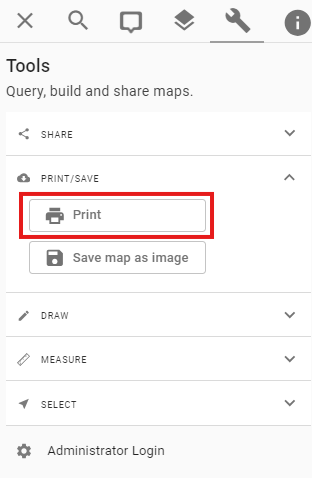
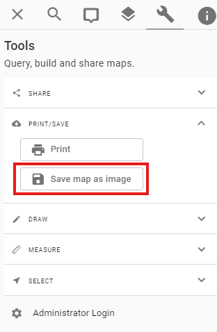
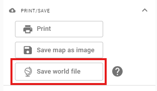
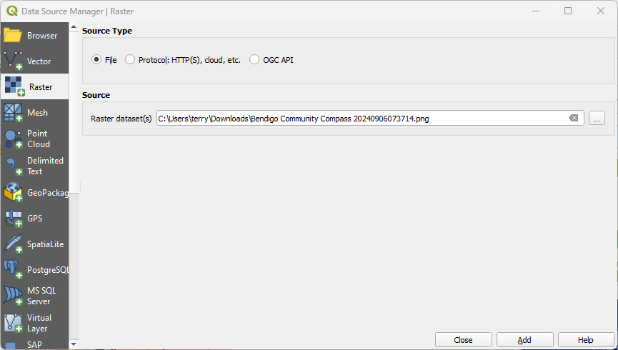
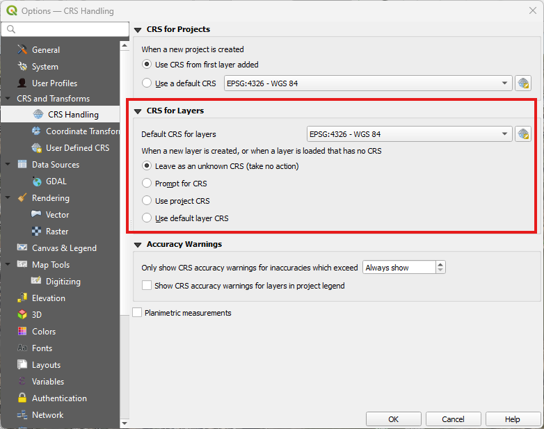
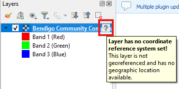
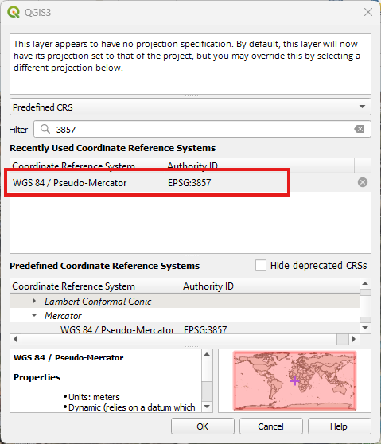
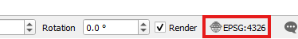

# Print

The Pozi map view and associated information can be saved to a PDF for printing or sharing.

{style="width:200px"}

## Settings

#### Title

By default, the map title will be generic name of the map.

To override the title with your own text, clear the existing content of the Title box, then type in your own. Click the Refresh button to show the heading in the print preview.

!!! Multi-Line Title

Pozi supports multi-line map titles. Even though the Title box is small and narrow in the side panel, you can type in long titles, including multiple lines.

!!!

#### Size

Pick from the available pages sizes:

- **A4** (default)
- **A3**

The map and supporting information will be scaled to fit the chosen page size.

#### Orientation

Pick from the available pages orientations:

- **Landscape** (default)
- **Portrait**

The map and supporting information will be arranged to fit the chosen orientation.

#### Scale

Pick from these scales:

- **Current view** (default)
- **1:250**
- **1:500**
- **1:1,000**
- **1:2,000**
- **1:5,000**
- **1:10,000**
- **1:15,000**
- **1:20,000**
- **1:50,000**
- **1:100,000**
- **1:250,000**

#### Side Panel

- **Show details**: display the info results of any selected features or *What's Here* results
- **Show legend**: display the legend of any active map layers
- **None**: hide the panel and maximise the map size

#### Options

##### Add Statistics

Print an additional page that contains statistics for any active vector layer. Pozi will generate statistics based on the any number fields for any features within the map bounds.

## Save Map

The current Pozi map view can be exported to an image file on your device.  Go to the `Tools` panel in Pozi and select `Print\Save`.

When selected, the option to `Save map as image` will save the map as a **PNG**, and will expose the option to save a corresponding world file

If this button is pushed a **.PNGW** file will also be downloaded that contains georeference information about the image. 

The image and the world file will have the same name but different extensions. So if the image file is **"Bendigo Community Compass 20240906073714.png"**, the world file created will be called **"Bendigo Community Compass 20240906073714.pngw"**.

### Adding a Georeferenced Image to QGIS

Start QGIS.

Select `Layer` -> `Add Layer` -> `Add Raster Layer..` to open the following dialog:

Navigate to the downloaded PNG file, and then click the `Add` button.  Then click the `Close` button

You might see a warning message that the CRS for the image is undefined, if you have QGIS set to `Prompt for CRS` (see below).

In any case the world file (.PNGW file) will be applied to the image as long as it is in the same directory as the PNG file.

To correctly project the image the new layers projection should be set to **EPSG:3857**.  This can either be done when prompted, or by clicking on the question mark next to the layer in the `Layer Panel`.  Depending on any other layers that are currently open in QGIS, it may correctly guess the projection without requiring the CRS to be set.

In the dialog box that presents, filtering to `3857` will limit the list to the relevant projection.  Then select `WGS 84 / Pseudo-Mercator` in the highlighted box and push the `OK` button.

Depending on the project based CRS that is currently defined, the image may disappear from view and/or appear distorted once the layer CRS has been set.  In order to remove distortion set the project based CRS to `WGS 84 / Pseudo-Mercator` by clicking on the `EPSG` setting in the bottom-right corner of the screen.  If the image is still out of view the `Zoom to Layer` or `Previous Zoom` functionality of QGIS can be used to zoom to the correct location.

